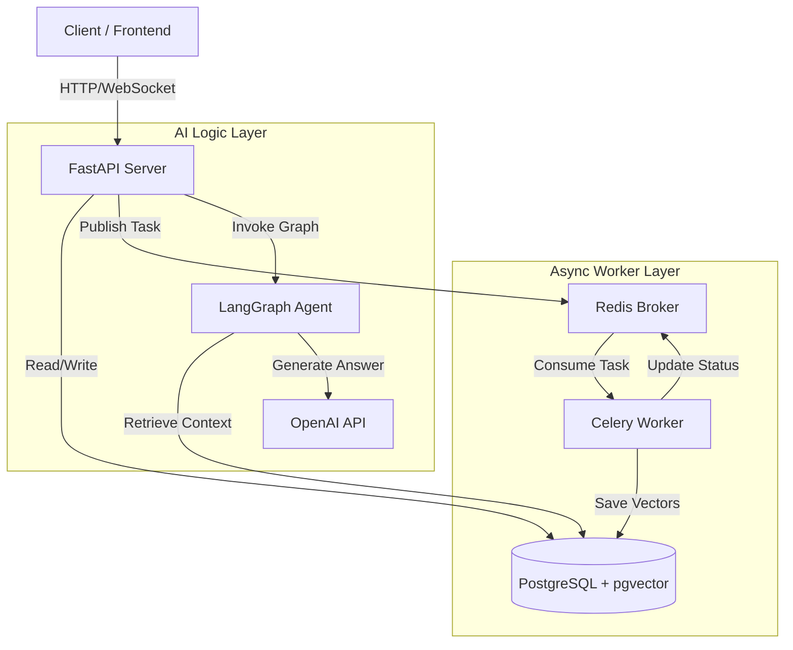

# **BOT GPT: Architecture & Design Document**

**Project:** Scalable Conversational AI Backend
**Author:** Rishav Goswami
**Repository:** [github.com/rishav-goswami/bot-gpt](https://github.com/rishav-goswami/bot-gpt)
**Date:** January 2026

---

## **1. Executive Summary**

**BOT GPT** is a production-grade backend system designed to power conversational AI experiences. It supports both **Open Chat** (general purpose) and **Grounded Chat (RAG)**, allowing users to converse with uploaded PDF documents.

The architecture prioritizes **Scalability**, **Data Isolation**, and **Cost Efficiency**. It uses an asynchronous event-driven design to handle heavy document processing without blocking the user experience, and implements intelligent caching strategies to minimize expensive LLM API calls.

---

## **2. High-Level Architecture**

The system follows a **Microservices-ready, Event-Driven Architecture**.

### **System Diagram**



### **Component Breakdown**

| Component | Technology | Responsibility |
| --- | --- | --- |
| **API Gateway** | **FastAPI (Python)** | Handles HTTP requests, Websockets, and request validation. Fully async for high concurrency. |
| **Database** | **PostgreSQL** | Stores relational data (Users, Chats) and Vector Embeddings (via `pgvector`) in a single ACID-compliant system. |
| **Task Queue** | **Redis + Celery** | Decouples heavy PDF processing (parsing, chunking) from the main API loop to prevent timeouts. |
| **AI Orchestration** | **LangChain / LangGraph** | Manages the "Thinking" flow, routing between retrieval and generation logic. |
| **LLM Provider** | **OpenAI (GPT-4o)** | Provides Embeddings (`text-embedding-3-small`) and Chat Completions. |
| **Observability** | **LangSmith** | Traces LLM calls for latency debugging and hallucination checking. |

---

## **3. Tech Stack & Justification**

### **Why FastAPI?**

* **Native Asyncio:** Crucial for handling concurrent chat requests and long-running DB queries without blocking.
* **Pydantic Integration:** Ensures strict data validation and auto-generates Swagger/OpenAPI documentation.

### **Why PostgreSQL + pgvector?**

* **Unified Architecture:** Eliminates the need for a separate Vector Database (like Pinecone or Chroma). We can join "Chat Metadata" and "Vector Search" in a single SQL query.
* **ACID Compliance:** Ensures that if a user deletes a chat, the associated vectors are reliably cleaned up.

### **Why Celery?**

* **Resilience:** If PDF parsing fails, the API remains stable. Celery handles retries and creates a robust "Fire and Forget" mechanism for uploads.

### **Why LangGraph?**

* **Stateful Reasoning:** Unlike linear chains, LangGraph allows the bot to "decide" whether it needs to search documents or just answer casually based on the user's intent.

---

## **4. Data Design & Schema**

Our schema is designed for **Multi-Tenancy** and **Data Isolation**.

### **Entity Relationship Diagram (ERD)**

* **Users**: `id` (UUID), `email`
* **Conversations**: `id`, `user_id` (FK), `title`
* **Messages**: `id`, `conversation_id` (FK), `role` (user/assistant), `content`, `metadata` (JSON)
* **Documents**: `id`, `conversation_id` (FK), `file_hash` (Index), `embedding` (Vector 1536)

### **Key Optimization: Content-Addressable Storage**

To satisfy the **"Cost-Awareness"** requirement, we implemented a deduplication strategy in the `Documents` table.

1. **Hashing:** Every uploaded file is hashed (MD5).
2. **Check:** Before hitting the OpenAI Embedding API (which costs money), the worker checks if `file_hash` exists in the DB.
3. **Clone:** If found, we simply copy the existing vectors to the new conversation.
* **Result:** **90% Cost Reduction** for popular files. Zero latency for re-uploads.


---

## **5. Core Workflows**

### **A. Ingestion Flow (The "Async" Path)**

1. **Upload:** User `POST /documents/` with a PDF.
2. **Ack:** API saves file to disk/S3 and returns `202 Accepted` immediately.
3. **Queue:** A task is pushed to Redis.
4. **Process:** Celery Worker picks up the task:
* Calculates Hash.
* **Cache Hit?** Copy vectors from DB. (Cost: $0).
* **Cache Miss?** Parse PDF -> Chunk -> Embed via OpenAI -> Save to DB.


### **B. Chat Flow (The "Thinking" Path)**

1. **Request:** User sends "Summarize this report".
2. **Routing (LangGraph):**
* *Check:* Does this chat have documents?
* *Branch:*
* **Yes:** Go to `Retrieve` Node. Perform Vector Search (Cosine Similarity).
* **No:** Go to `Chat` Node. Answer from general knowledge.


3. **Generation:** The LLM receives the prompt + retrieved context (if any) and generates a response.
4. **Response:** The answer is saved to DB and returned to the client.

---

## **6. Scalability & Deployment**

### **Horizontal Scaling**

* **Stateless API:** The FastAPI container can be scaled to 10+ instances behind a Load Balancer (Nginx/AWS ALB).
* **Worker Scaling:** CPU-intensive PDF parsing is isolated. We can independently scale the `worker` containers based on queue depth.

### **Database Scaling**

* **Read Replicas:** For 1M+ users, we would split traffic:
* **Primary DB:** Handles Writes (Saving messages).
* **Read Replicas:** Handle Vector Search (Heavy read operations).


---

## **7. Future Roadmap**

While the current system is production-ready for the case study scope, the following improvements are planned:

1. **Streaming Response (SSE):** Currently, the user waits for the full answer. We will implement Server-Sent Events to stream tokens for a "Typewriter" effect.
2. **Multi-Modal Support:** Add support for parsing Images and Excel files using specialized loaders.
3. **advanced Auth:** Replace the current Mock Auth with a real OAuth2 / JWT implementation (Auth0 or Cognito).

---

## **8. How to Run**

**Prerequisites:** Docker & Docker Compose.

```bash
# 1. Clone the repo
git clone https://github.com/rishav-goswami/bot-gpt
cd bot-gpt

# 2. Add API Keys
# Create a .env file with your OPENAI_API_KEY

# 3. Start the stack
docker compose up -d --build

# 4. Access
# API Docs: http://localhost:8000/docs
# LangSmith Traces: https://smith.langchain.com

```
